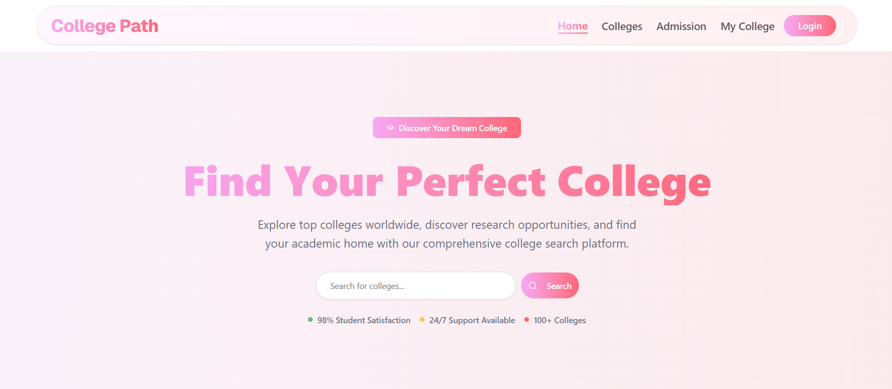

# 🎓 College Path – Book Your Future

College Path is a user-friendly web application built to help students explore, apply, and review colleges with ease. From searching top colleges to submitting admission forms and reviewing campus experiences, College Path offers everything in one smooth platform.

---

## 🛠️ Technologies Used

- **Frontend:** [Next.js](https://nextjs.org/), [Tailwind CSS](https://tailwindcss.com/)
- **Backend:** [Node.js](https://nodejs.org/), [Express.js](https://expressjs.com/)
- **Database:** [MongoDB](https://www.mongodb.com/)
- **Authentication:** [Firebase Authentication](https://firebase.google.com/products/auth)
- **Deployment:** [Vercel](https://vercel.com/), [Firebase Hosting](https://firebase.google.com/products/hosting)

---

## 🚀 Core Features

- 🔍 College search with live filtering
- 🏫 College cards with details like events, sports, and research
- 🖼️ College image gallery
- 📄 Real student research papers section
- ✍️ Apply for admission with an advanced form
- 📋 Personalized "My College" dashboard
- 💬 Add and view college reviews
- 🔐 Secure Login/Signup (Google, Email, Social)
- 👤 Editable user profile with saved data
- 📱 Fully responsive across all devices
- 🎨 Creative 404 page

---